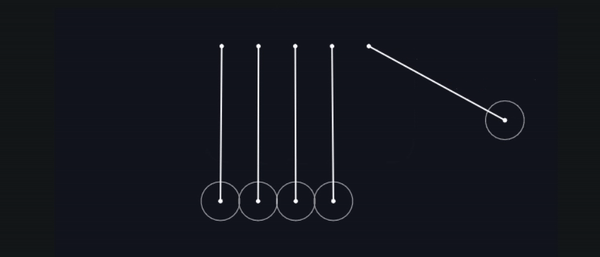

## 💡 Physics Lab

Learning Physics by Visualising - the fastest, easiest, and retainable way of learning Physics [here](https://physics-lab.vercel.app/)!

   

### 🧠 Inspiration

Bored from long physics lectures, I thought it would be nice to have something like this for me to learn some physics. But just using one isn't very exciting, so make one? Why Not?

### 📚 Contributions

Want to add another simulation to this project? Feel free to.
Read here for more details: [Contributions](./CONTRIBUTING.md)
